# Manual de usuario · Portal Salud

Cubre cada módulo del sistema, en el mismo orden en que aparecen en el menú lateral: cómo llegar y qué captura cada uno. La sección de Administración (Roles, Menús, Usuarios) va al final.

## Índice

**Empezar**
- [Acceso / login](#acceso--login)
- [Búsqueda NSS](#búsqueda-nss)

**Expediente General**
- [E. Laboratorio](#e-laboratorio) · [Histórico E.M](#histórico-em) · [Nota Médica](#nota-médica) · [Nota Incapacidad](#nota-incapacidad)
- [Archivo de Consultas](#archivo-de-consultas) · [Consulta Médica](#consulta-médica)
- [Incapacidades](#incapacidades) · [Archivo Incapacidades](#archivo-incapacidades)
- [Examen Médico](#examen-médico) · [Pre-Test](#pre-test)
- [Antidoping](#antidoping) · [Accidentes](#accidentes) · [Maternidad](#maternidad)

**Páginas independientes**
- [Dashboard](#dashboard) · [Consumibles de antidoping](#consumibles-de-antidoping) · [Antidoping — Selección aleatoria](#antidoping--selección-aleatoria) · [Causas de consulta](#causas-de-consulta)

**Administración**
- [Roles](#administración--roles) · [Menús por rol](#administración--menús-por-rol) · [Usuarios](#administración--usuarios)

---

## Acceso / login

`Pantalla de acceso (antes de iniciar sesión)`

Entra con tu **NSS y tu contraseña**. Lo que ves después de entrar (qué módulos aparecen en tu menú) depende del rol que tengas asignado.

> **Si no puedes entrar:** confirma tu NSS y contraseña con el equipo de sistemas. Si entras pero no ves ningún módulo en "Expediente General", es que tu usuario todavía no tiene un rol asignado — pide que te lo den de alta (ver [Usuarios](#administración--usuarios)).

## Búsqueda NSS

`Portal Salud → Búsqueda NSS`

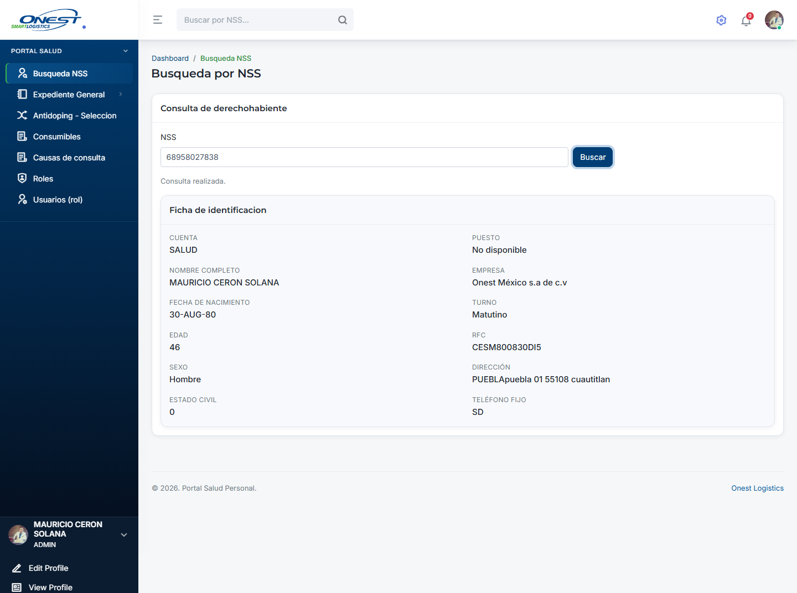

Es el punto de entrada a todo lo demás. Escribe el NSS de la persona y busca — si existe, aparece su **ficha de identificación** (nombre, puesto, cuenta, edad, etc.) y el menú "Expediente General" se activa en el lateral con los módulos que tu rol tiene permitido.

- Si el NSS pertenece a un **candidato** (sin registro de usuario aún), ves una ficha reducida (CURP, estado del proceso) en vez del expediente completo.
- Si el NSS está asociado a **más de un predio/cuenta**, se muestra un aviso listando cada asociación — no es un error, es una persona con varias relaciones laborales activas.

## E. Laboratorio

`Expediente General → E. Laboratorio`

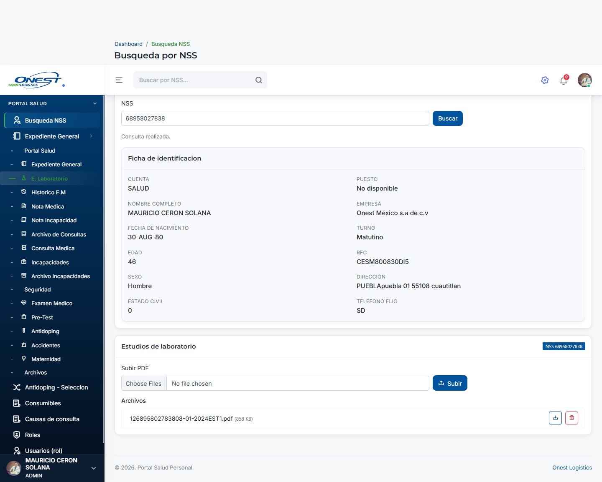

Repositorio de PDFs por NSS. Sube uno o varios archivos, y descárgalos o bórralos desde la misma lista. No es un formulario clínico — es solo almacenamiento de documentos asociados al NSS.

- Selecciona el PDF y da clic en **Subir** — verás un spinner mientras carga y el mensaje de resultado junto al botón.
- Cada archivo en la lista tiene botón de **descargar** y de **borrar**.

**Histórico E.M**, **Nota Médica** y **Nota Incapacidad** funcionan idénticamente — es la misma pantalla genérica, solo cambia la etiqueta y a qué categoría queda asociado el archivo.

## Histórico E.M

`Expediente General → Histórico E.M`

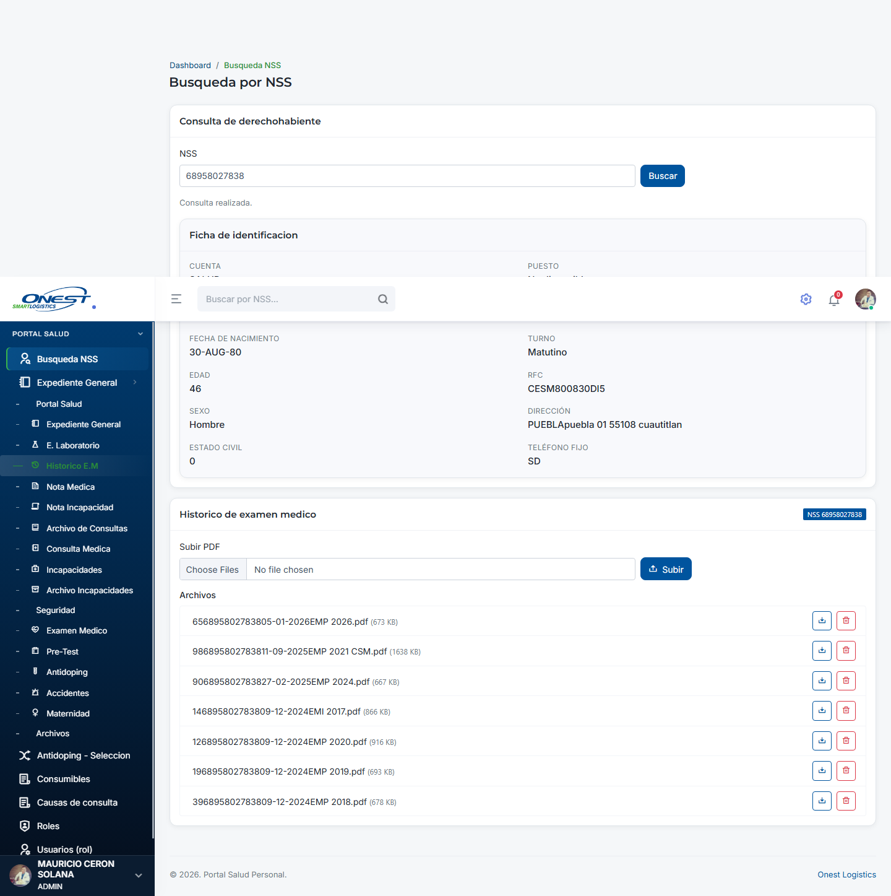

Mismo repositorio de PDFs que E. Laboratorio, para documentos de tipo "examen médico" histórico.

## Nota Médica

`Expediente General → Nota Médica`

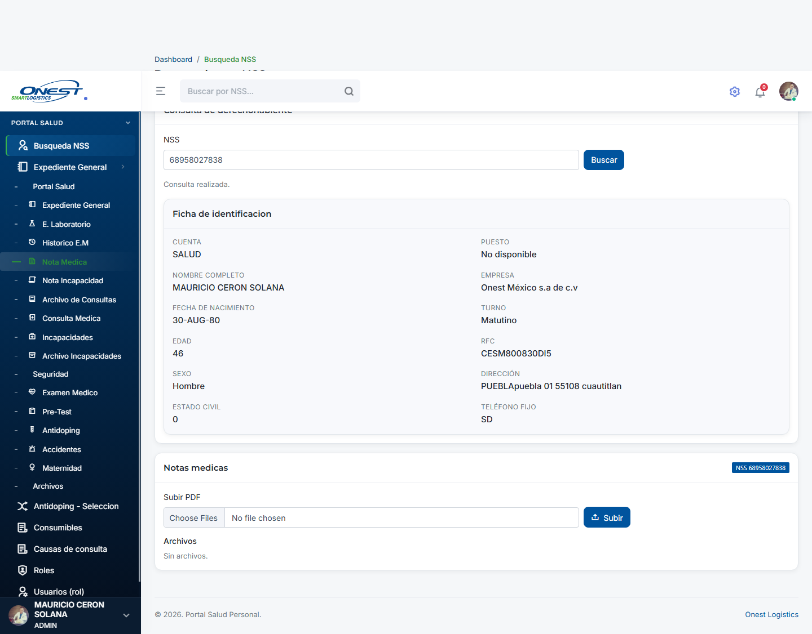

Mismo repositorio de PDFs que E. Laboratorio, para notas médicas.

## Nota Incapacidad

`Expediente General → Nota Incapacidad`

Mismo repositorio de PDFs que E. Laboratorio, para notas de incapacidad.

## Archivo de Consultas

`Expediente General → Archivo de Consultas`

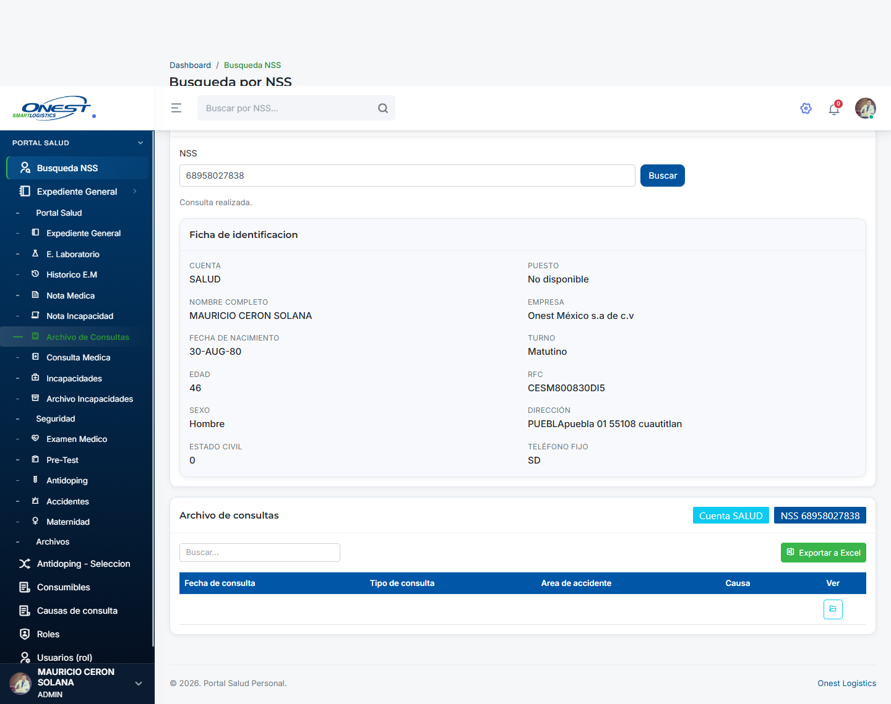

Historial completo de consultas médicas del NSS, en tabla. Búsqueda de texto libre y botón **Exportar a Excel** arriba de la tabla.

- Las consultas marcadas como **accidente/emergencia** se resaltan en amarillo con una etiqueta roja "Accidente" para que salten a la vista.
- Botón **Ver** (icono de carpeta) abre el detalle completo de esa consulta en una ventana modal, incluida la firma digital si se capturó.

## Consulta Médica

`Expediente General → Consulta Médica`

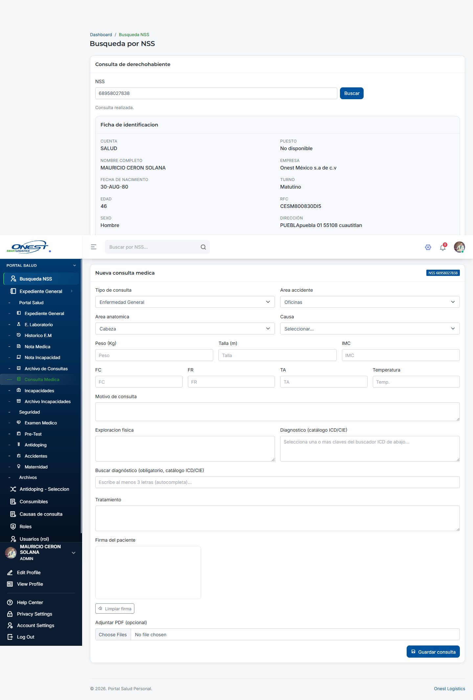

Formulario de alta de una consulta nueva.

**Qué captura:**

| Campo | Notas |
|---|---|
| Tipo de consulta | catálogo fijo |
| Área de accidente / anatómica | |
| Causa | catálogo administrable, ver [Causas de consulta](#causas-de-consulta) |
| Peso / talla | el IMC se calcula solo |
| FC / FR / TA / temperatura | |
| Motivo, exploración, tratamiento | texto libre |
| Diagnóstico | buscador de catálogo ICD/CIE, no texto libre |
| Firma del paciente | dibujada en pantalla |
| PDFs adjuntos | opcional |

Para el diagnóstico, escribe al menos 3 letras en el buscador ICD y elige de la lista que aparece — es obligatorio antes de poder guardar. Al guardar exitosamente, el formulario se limpia (incluida la firma) para capturar el siguiente caso sin arrastrar datos de la anterior.

## Incapacidades

`Expediente General → Incapacidades`

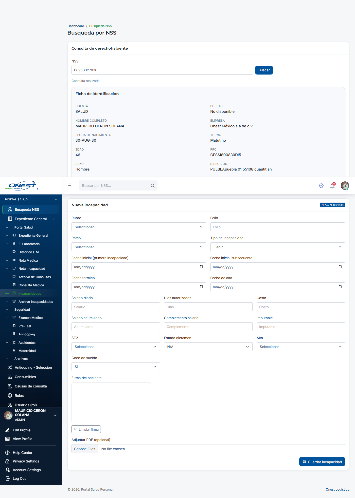

Formulario de alta de una incapacidad nueva.

| Campo | Notas |
|---|---|
| Rubro | Interna / IMSS |
| Ramo | Enfermedad General, Profesional, RT1, RT2, Maternidad |
| Tipo | Inicial / Subsecuente |
| Fechas | primera, inicio subsecuente, término, alta |
| Salario diario / días autorizados | el costo se calcula solo |
| ST2, estado dictamen, alta, goce de sueldo | |
| Firma del paciente + PDFs adjuntos | |

## Archivo Incapacidades

`Expediente General → Archivo Incapacidades`

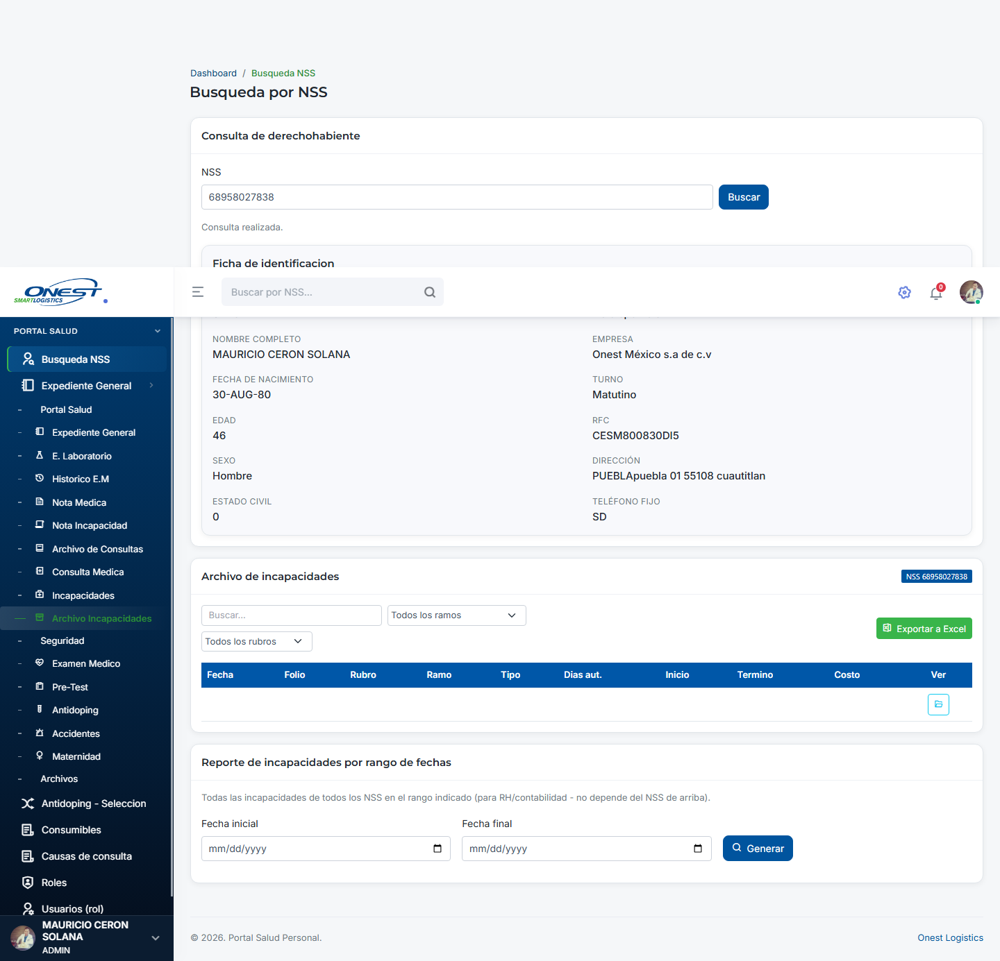

Historial en tabla de todas las incapacidades del NSS (esta es la **lista** — para dar de alta una nueva usa [Incapacidades](#incapacidades)).

- Filtros por **Ramo** y por **Rubro**, además del buscador de texto libre.
- **Exportar a Excel** respeta los filtros activos.

## Examen Médico

`Expediente General → Examen Médico`

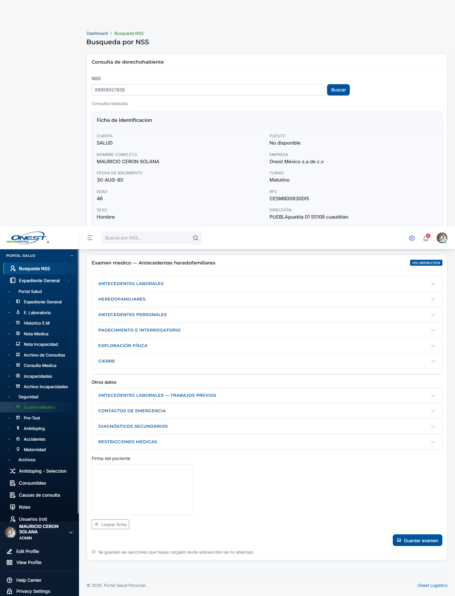

El módulo más grande del portal — antecedentes heredofamiliares completos, organizados en un acordeón por grupo, y dentro de cada grupo, pestañas por sección. Cada pestaña se carga sola la primera vez que la abres y **no se borra si cambias de pestaña** sin haber guardado — puedes ir y venir entre secciones sin perder lo que ya capturaste.

> **Guardar:** el botón "Guardar examen" al final solo envía las secciones que **ya abriste** en esta sesión — así no sobreescribe con vacío las que no tocaste.

**Secciones aparte, con su propio botón de guardar:**

- **Antecedentes laborales** — tabla de trabajos previos, agregas uno por empleo anterior.
- **Contactos de emergencia** — hasta 3.
- **Diagnósticos secundarios** — hasta 3, cada uno con su propio buscador ICD.
- **Restricciones médicas** — catálogo fijo (RES-01 a RES-16); las activas se marcan con una franja ámbar. Puedes definir valor límite, unidad, vigencia y médico responsable.

Al final del formulario: firma del paciente.

## Pre-Test

`Expediente General → Pre-Test`

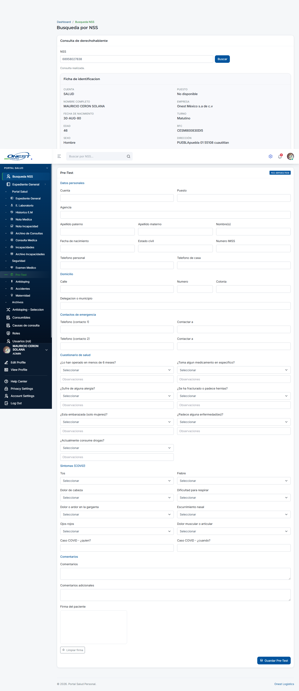

Cuestionario de ingreso: datos personales, domicilio, contactos de emergencia, cuestionario de salud (sí/no con observaciones) y síntomas. Termina con la firma del paciente.

## Antidoping

`Expediente General → Antidoping`

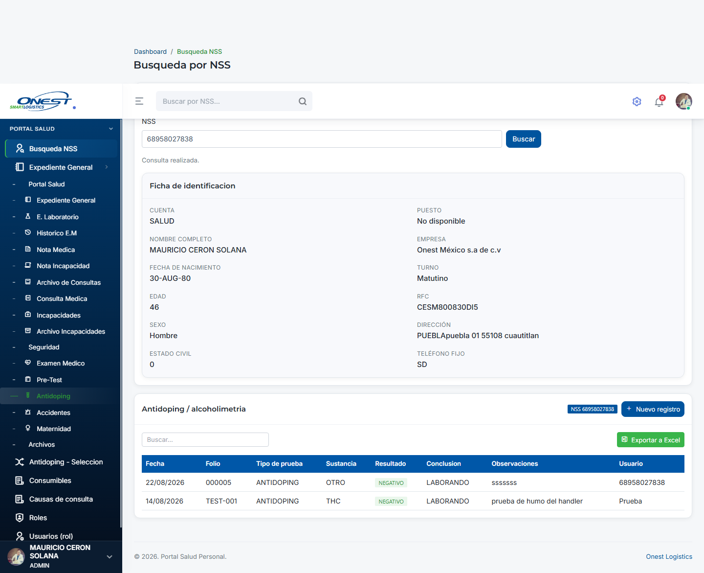

Lista de registros de antidoping/alcoholemia del NSS, con botón **Nuevo registro** arriba.

| Campo | Notas |
|---|---|
| Tipo de prueba | Antidoping / Alcoholemia |
| Sustancia | solo si es Antidoping (AMF, THC, COC, etc.) |
| Resultado | Negativo / Positivo (se resalta en rojo si es Positivo) |
| Status / conclusión | |

Ver también [Antidoping — Selección aleatoria](#antidoping--selección-aleatoria) para elegir a quién le toca la prueba.

## Accidentes

`Expediente General → Accidentes`

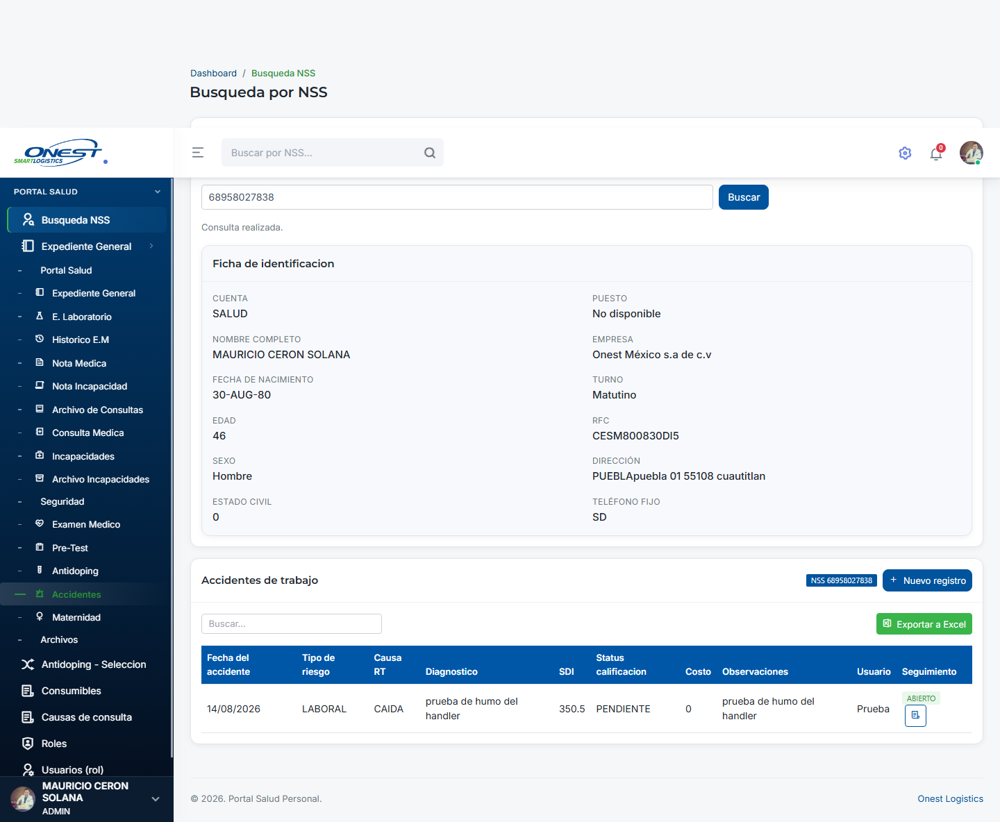

Lista de accidentes de trabajo del NSS, con botón **Nuevo registro**.

| Campo | Notas |
|---|---|
| Tipo de riesgo | Laboral / Trayecto |
| Causa RT | catálogo cerrado (caída, golpe, accidente vial, etc.) |
| SDI / costo | |
| Status de calificación | |

Cada caso tiene un badge de **estado** (Abierto/Cerrado) y un botón para ver su **seguimiento** — el caso se sigue actualizando después del alta inicial, no es un registro cerrado de una sola vez.

## Maternidad

`Expediente General → Maternidad`

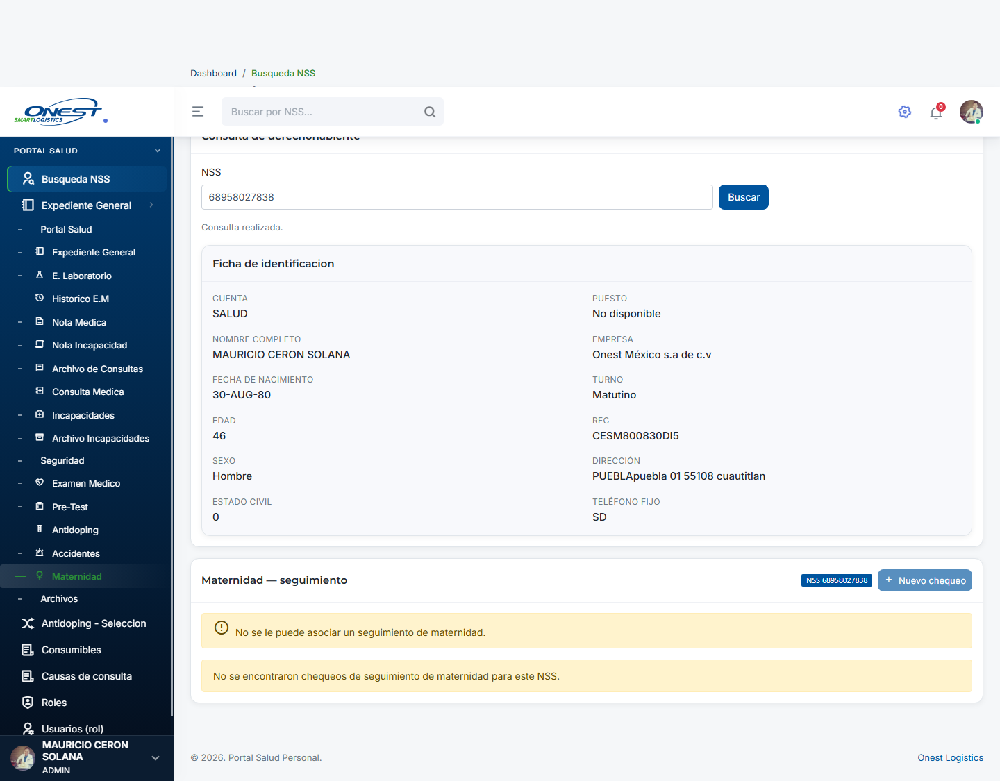

Historial de seguimiento de embarazo, con botón **Nuevo chequeo**.

> **Solo disponible para NSS de mujer.** Si el NSS corresponde a un hombre, el botón de nuevo chequeo aparece deshabilitado con un aviso — no se puede asociar un seguimiento de maternidad a esa persona.

Cada chequeo captura semanas de gestación, fecha probable de parto, próxima revisión, restricciones laborales y estatus. Ningún campo (salvo el NSS) es obligatorio — un chequeo temprano puede no tener aún fechas definidas.

---

## Dashboard

`Pantalla de inicio (al iniciar sesión)`

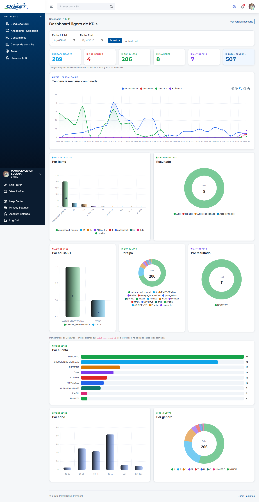

Pantalla de inicio al entrar al portal. Resumen general con tarjetas de KPI (incapacidades, accidentes, consultas, exámenes, antidoping y total) y gráficas: tendencia mensual combinada, incapacidades por ramo, resultados de antidoping, accidentes por causa, exámenes por tipo/resultado, y consultas por cuenta/edad/género.

## Consumibles de antidoping

`Portal Salud → Consumibles`

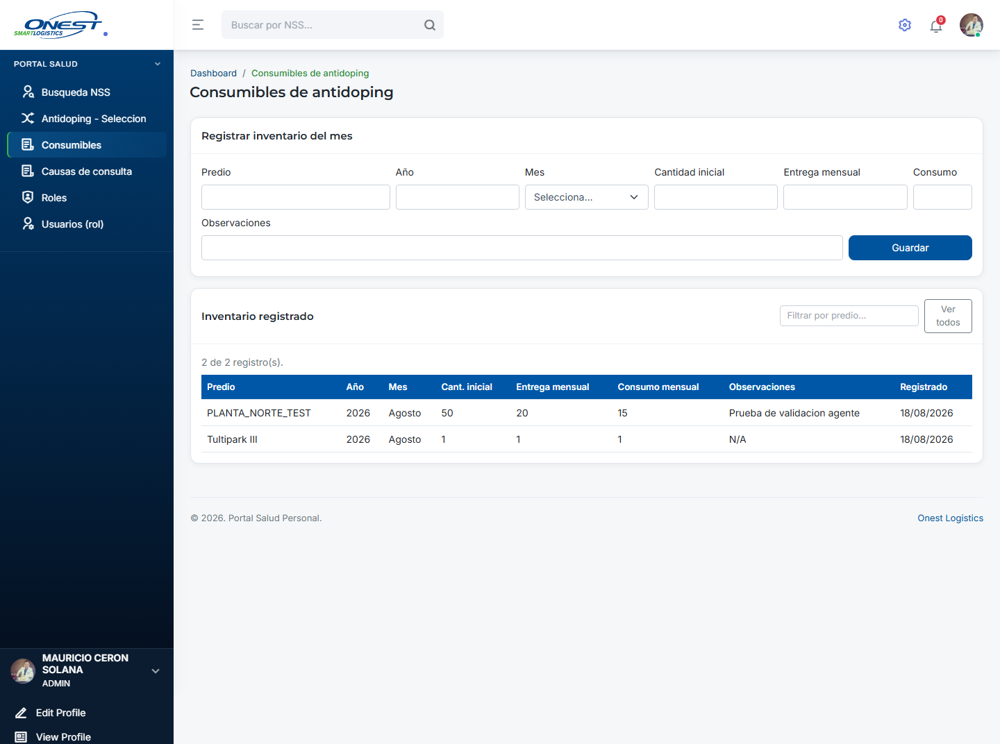

Registro mensual de inventario de pruebas de antidoping por predio — no depende de un NSS, es control de almacén.

| Campo | Notas |
|---|---|
| Predio, año, mes | |
| Cantidad inicial / entrega mensual / consumo | |

## Antidoping — Selección aleatoria

`Portal Salud → Antidoping - Selección`

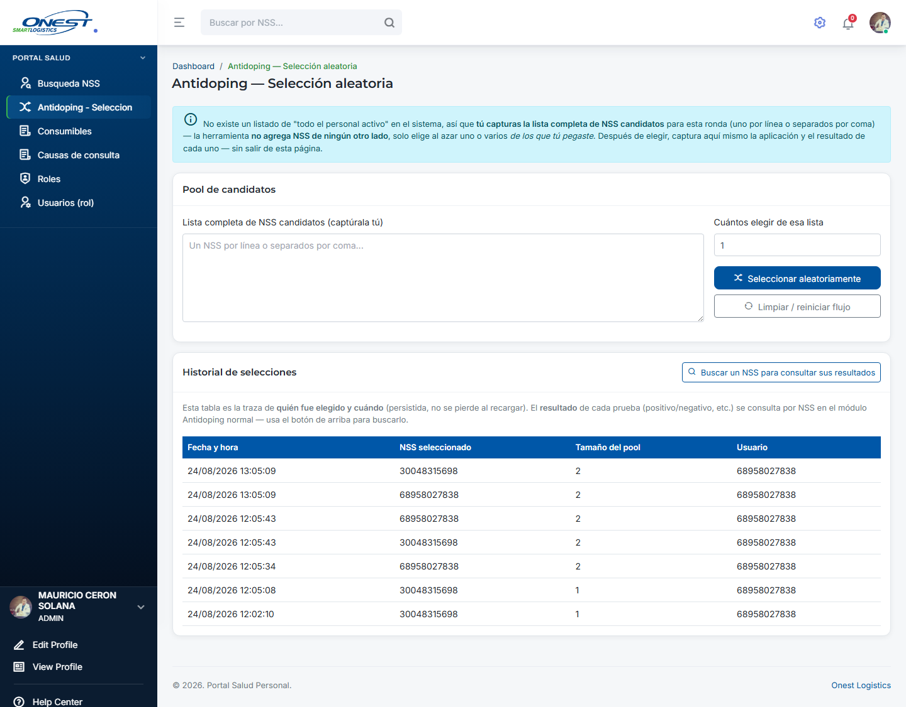

Herramienta para elegir al azar a quién le toca antidoping de una lista de candidatos.

1. Pega la lista completa de NSS candidatos (uno por línea o separados por coma) — el sistema **no tiene una lista de "todo el personal"**, así que tú capturas el universo de esta ronda cada vez.
2. Indica cuántos elegir y da clic en **Seleccionar aleatoriamente**.
3. Captura la aplicación y el resultado de cada seleccionado, sin salir de la página.
4. **Limpiar / reiniciar flujo** borra todo para empezar una ronda nueva.

## Causas de consulta

`Portal Salud → Causas de consulta`

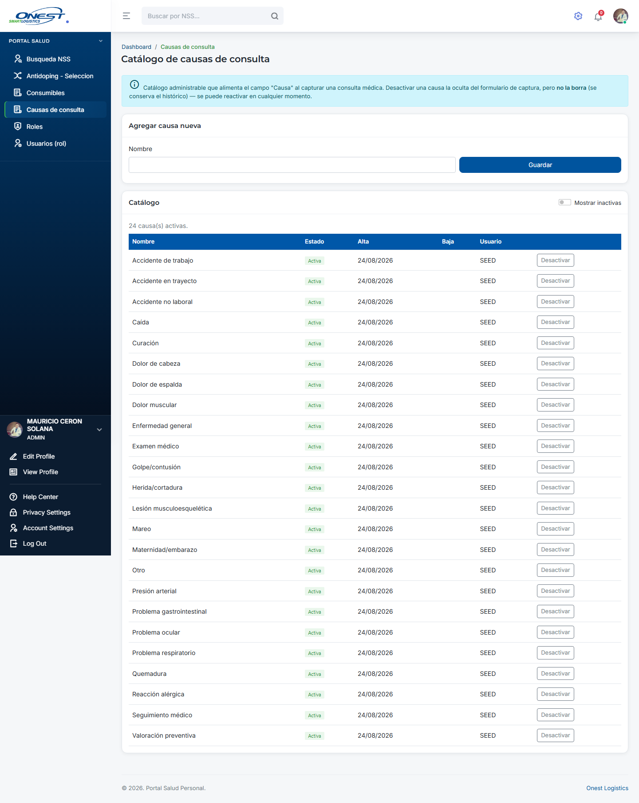

Catálogo administrable que alimenta el campo "Causa" de [Consulta Médica](#consulta-médica). Da de alta causas nuevas y actívalas/desactívalas — desactivar oculta la causa del formulario de captura pero **no borra** el histórico ya guardado con ella.

---

## Administración — Roles

`Administración → Roles`

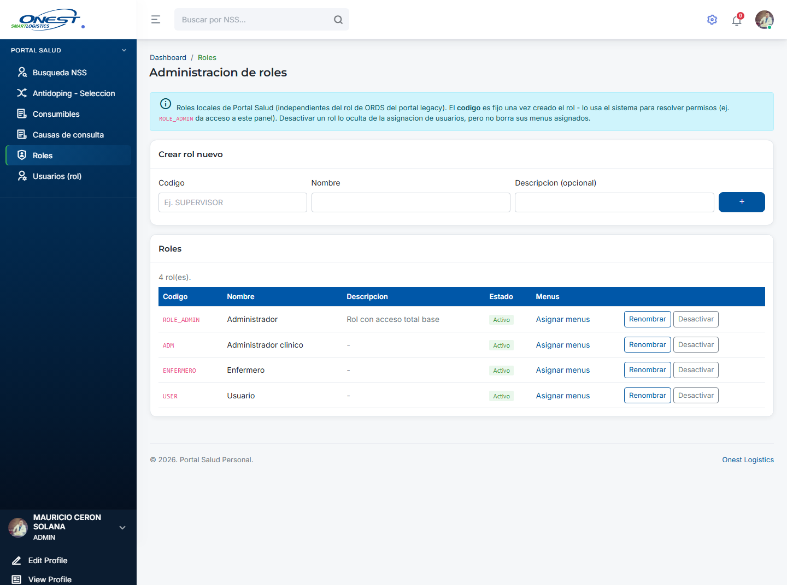 · **Nuevo**

Solo visible para usuarios con rol administrador. Aquí se crean y administran los roles que determinan qué ve cada persona en "Expediente General".

- **Crear rol** — código (fijo una vez creado), nombre y descripción.
- **Renombrar** — cambia nombre/descripción de un rol existente (el código no se puede cambiar).
- **Activar / Desactivar** — un rol desactivado deja de poder asignarse, pero no borra nada de lo que ya tenía asignado.

**Roles que ya existen hoy:**

| Rol | Código | Descripción |
|---|---|---|
| Administrador clínico | `ADM` | Acceso completo a los 14 módulos. |
| Usuario | `USER` | Acceso estándar, sin Antidoping, Accidentes ni Maternidad. |
| Enfermero | `ENFERMERO` | Como Usuario, pero tampoco ve Expediente General ni E. Laboratorio. |
| Administrador | `ROLE_ADMIN` | Da acceso a esta sección de Administración — es aparte de los roles clínicos de arriba, una persona puede tener ambos. |

## Administración — Menús por rol

`Administración → Roles → Asignar menús`

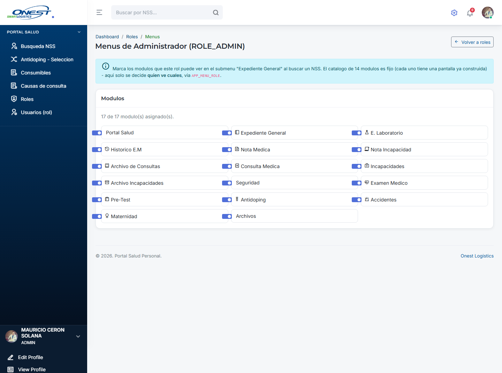 · **Nuevo**

Desde Roles, botón "Asignar menús" en la fila de cada rol. Muestra los 14 módulos del catálogo como interruptores — actívalos o desactívalos, el cambio se guarda al instante con cada clic, sin botón de guardar aparte.

> **El catálogo de 14 módulos es fijo.** Aquí solo decides **quién ve cuáles** — no se pueden inventar módulos nuevos desde esta pantalla, cada uno de los 14 tiene su propia pantalla ya construida en el sistema.

## Administración — Usuarios

`Administración → Usuarios`

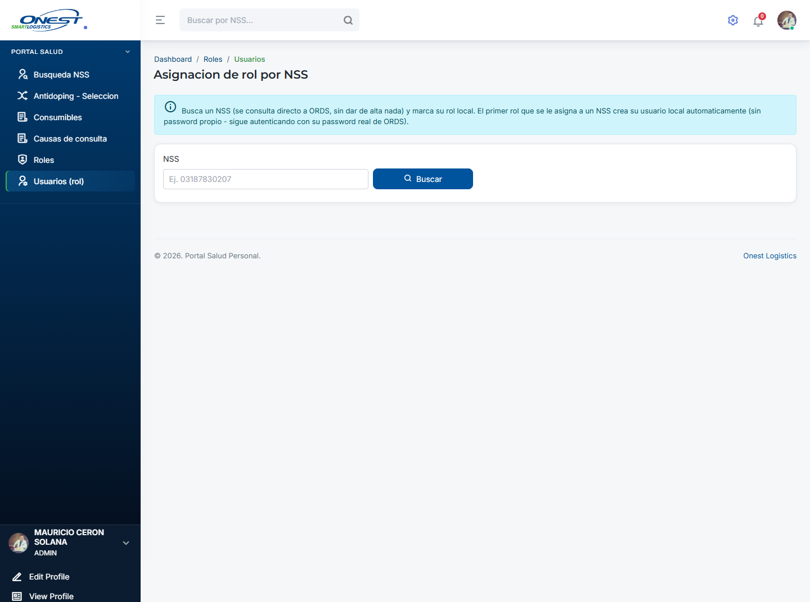 · **Nuevo**

Aquí se le da de alta el acceso a una persona nueva o se le cambia el rol a alguien que ya tiene acceso.

1. Busca por NSS — se consulta directo contra el sistema central, sin dar de alta nada todavía.
2. Si existe, aparece su nombre real y un interruptor por cada rol disponible.
3. Activa el rol que le corresponda — el primer rol que se le asigna a un NSS crea su acceso automáticamente. No hace falta definirle una contraseña aparte: sigue entrando con su contraseña de siempre.
